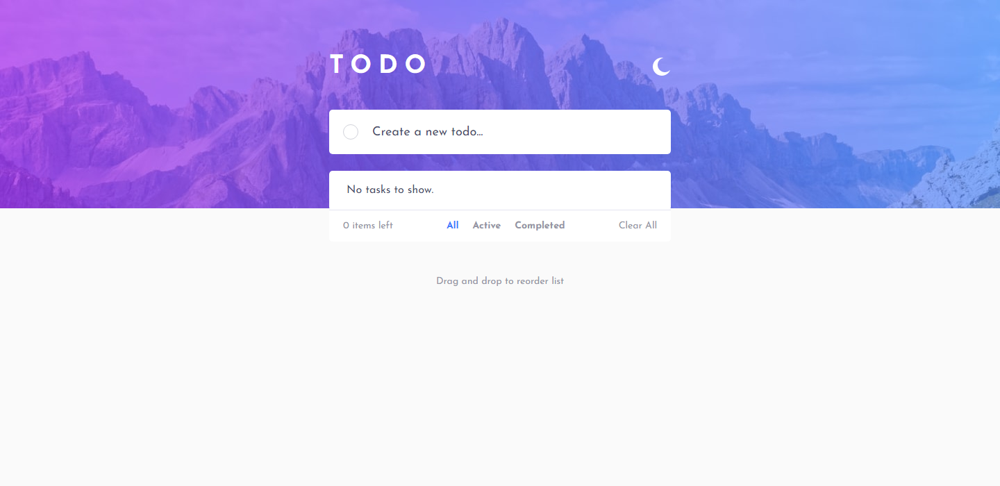
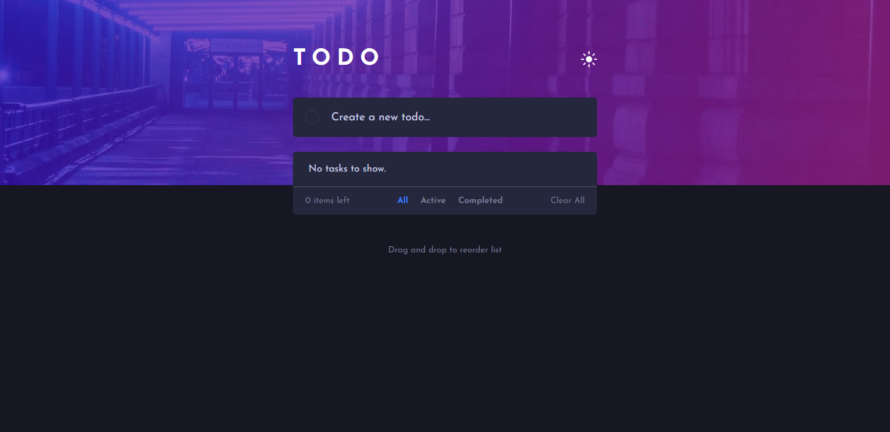
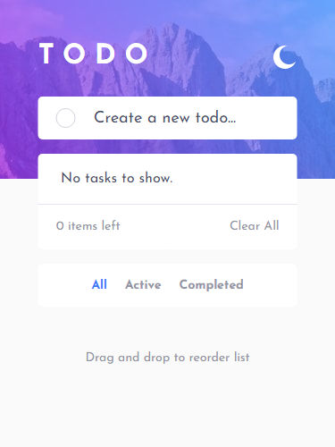
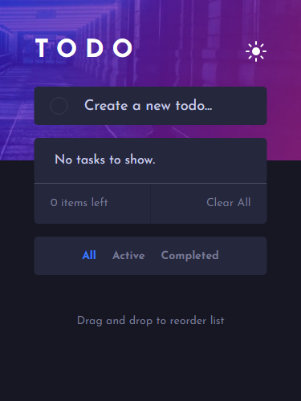

# Frontend Mentor - Todo app solution

This is a solution to the [Todo app challenge on Frontend Mentor](https://www.frontendmentor.io/challenges/todo-app-Su1_KokOW). Frontend Mentor challenges help you improve your coding skills by building realistic projects.

## Links

- Live Site [URL](https://todos-react-pwa.netlify.app)
- Solution [URL](https://www.frontendmentor.io/solutions/react-todos-app-6gxAj7JvV)

- MVC App [URL](https://github.com/Mhmd-Tarek-Mhmd/Todos-App/tree/mvc-app)

## Screenshots

### 1- Desktop Design

### 2- Mobile Design

